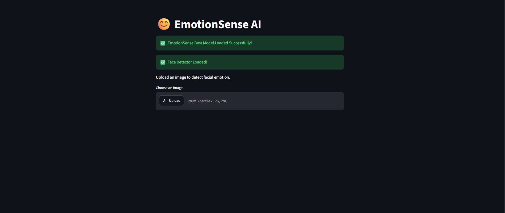
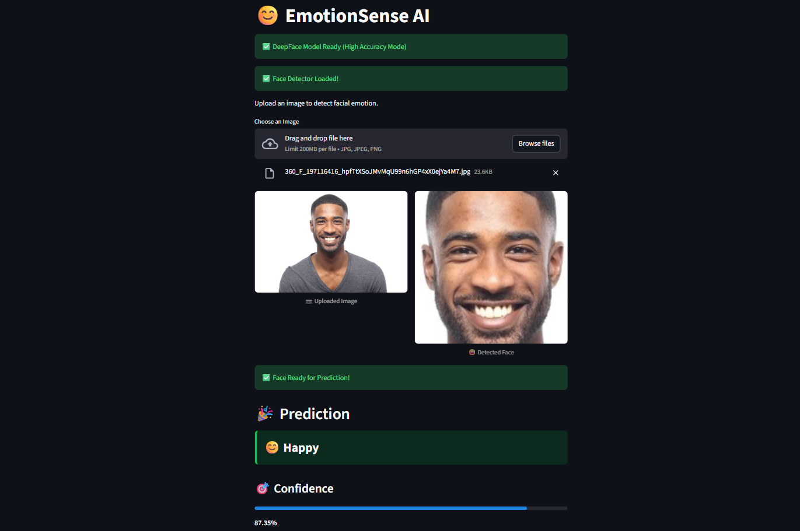
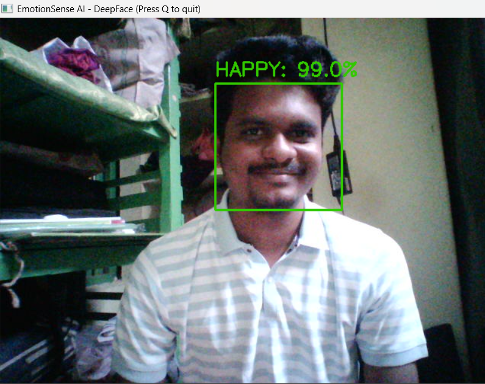
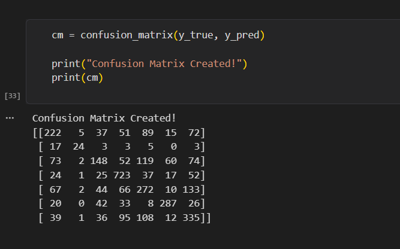

# 😊 EmotionSense AI


An end-to-end Facial Emotion Recognition System built using **TensorFlow**, **EfficientNetB0**, **DeepFace**, **OpenCV**, and **Streamlit**. The application detects human facial emotions from uploaded images and real-time webcam feeds, classifying them into seven distinct emotion categories with high-accuracy prediction pipelines and interactive UI analytics.

---

## 📌 Project Overview

EmotionSense AI is a deep learning-based application designed to recognize facial expressions and predict emotions in real time.

The project incorporates **Transfer Learning with EfficientNetB0** (fine-tuned on the FER2013 dataset) and **DeepFace High-Accuracy Analysis**, paired with **OpenCV Haar Cascade Face Detection**.

The application supports:

- 📷 **Single Image Emotion Prediction**: Upload images via Streamlit web app with face detection, crop previews, confidence scores, and probability breakdowns.
- 🎥 **Real-Time OpenCV Webcam Tracking**: Standalone live camera analysis with frame-sampling performance optimization and color-coded emotion bounding boxes.
- 📊 **Model Evaluation**: Metrics, confusion matrix, and classification report documentation.
- 🌐 **Interactive Streamlit Web Application**: Rich visual interface with dynamic color cards, progress meters, and emotion rankings.

---

## ✨ Features

- **Multi-Engine Emotion Recognition**: Combines fine-tuned EfficientNetB0 architecture with DeepFace ensemble model inference.
- **OpenCV Face Detection & Preprocessing**: Utilizes Haar Cascade Classifiers (`haarcascade_frontalface_default.xml`) for face isolation.
- **7 Facial Emotion Classes**: Detects Angry, Disgust, Fear, Happy, Neutral, Sad, and Surprise.
- **Real-Time Webcam Streaming**: Optimized OpenCV loop (`webcam.py`) with frame sampling (`ANALYZE_EVERY = 10`) for lag-free performance.
- **Interactive Streamlit UI**: Rich visual indicators with custom CSS emotion styling, confidence progress bars, and sorted probability list.
- **Modular Code Architecture**: Clean separation between web interface (`app.py`), helper utilities (`utils.py`), and standalone webcam application (`webcam.py`).
- **Comprehensive Evaluation**: Training scripts, confusion matrix visualizations, and performance metrics included.

---

## 😊 Supported Emotions

| Label | Emotion | Emoji | Color Theme |
|:---:|:---:|:---:|:---:|
| 0 | Angry | 😡 | `#FF4B4B` (Red) |
| 1 | Disgust | 🤢 | `#7B5EA7` (Purple/Brown) |
| 2 | Fear | 😨 | `#FF8C00` (Orange) |
| 3 | Happy | 😊 | `#00CC44` (Green) |
| 4 | Neutral | 😐 | `#4B8BF5` (Blue/Cyan) |
| 5 | Sad | 😢 | `#0099FF` (Light Blue) |
| 6 | Surprise | 😲 | `#FF69B4` (Pink) |

---

## 🛠 Technologies & Libraries Used

- **Languages & Frameworks**: Python 3.11, TensorFlow / Keras, DeepFace
- **Computer Vision**: OpenCV (`cv2`), MediaPipe
- **Machine Learning & Analytics**: EfficientNetB0, NumPy, Pandas, Scikit-learn, Matplotlib, Seaborn
- **Web Interface**: Streamlit
- **Development Tools**: Jupyter Notebook, Kaggle API

---

## 📂 Project Structure

```text
EmotionSense_AI/
│
├── streamlit_app/           # Streamlit & OpenCV Deployment Application
│   ├── app.py               # Main Streamlit Web Application (DeepFace + OpenCV UI)
│   ├── utils.py             # Preprocessing & Detection Helper Functions
│   └── webcam.py            # Real-Time OpenCV Live Webcam Emotion Tracker
│
├── models/                  # Saved Trained Models (.h5 / .keras)
├── notebooks/               # Data Exploration, Model Training & Fine-Tuning
├── outputs/                 # Evaluation plots, confusion matrices & screenshots
│   └── screenshots/         # Web App UI Screenshots
├── test_images/             # Sample images for testing inference
│
├── camera_test.py           # Quick webcam diagnostic check
├── test_setup.py            # Environment & library import verification script
├── config.py                # Global configuration settings
├── main.py                  # Main execution entrypoint
├── requirements.txt         # Project dependencies
└── README.md                # Project documentation
```

---

## 🧠 Model Architecture & Pipeline

1. **Face Detection Pipeline**:
   - Input frame converted to grayscale.
   - OpenCV Haar Cascade Classifier detects bounding coordinates `(x, y, w, h)`.
   - Cropped face region is isolated for model processing.

2. **Inference Pipelines**:
   - **EfficientNetB0 (Transfer Learning)**: Pretrained on ImageNet, fine-tuned on FER2013 with Global Average Pooling, Dense layers, Dropout, and Softmax output.
   - **DeepFace Engine**: Integrated in high-accuracy mode for robust real-time facial expression analysis.

---

## 📊 Dataset & Baseline Results

**Dataset**: FER2013 (Facial Expression Recognition 2013) dataset featuring 7 emotion categories.

| Metric | Value |
|:---|:---|
| **Test Accuracy** | **56.00%** (Fine-Tuned EfficientNetB0 Baseline) |
| **Number of Classes** | 7 |
| **Model Architectures** | EfficientNetB0 / DeepFace |
| **Input Image Size** | 224 × 224 |
| **Framework** | TensorFlow / Keras / DeepFace |

---

## 🚀 Installation & Setup

1. **Clone the Repository**
   ```bash
   git clone https://github.com/Bharanitharan-P/EmotionSense_AI.git
   cd EmotionSense_AI
   ```

2. **Create & Activate Virtual Environment (Recommended)**
   ```bash
   python -m venv venv
   # On Windows:
   venv\Scripts\activate
   # On macOS/Linux:
   source venv/bin/activate
   ```

3. **Install Dependencies**
   ```bash
   pip install -r requirements.txt
   ```

4. **Verify Installation (Optional)**
   ```bash
   python test_setup.py
   ```

---

## ▶️ Running the Application

### 1. Interactive Streamlit Web App (Image Upload & Prediction)
Launch the Streamlit web application to upload images, view cropped face detection, get high-accuracy emotion predictions, and analyze confidence distributions:
```bash
streamlit run streamlit_app/app.py
```

### 2. Standalone Real-Time OpenCV Webcam Tracker
Launch live webcam tracking with real-time bounding boxes, dynamic emotion labels, and color-coded feedback:
```bash
python streamlit_app/webcam.py
```
> *Press **Q** to exit the webcam window.*

---

## 📷 Screenshots

### 🏠 Home Page


---

### 🖼 Image Prediction


---

### 🎥 Webcam Prediction


---

### 📊 Confusion Matrix


---

## 🔮 Future Improvements

- [ ] Further fine-tune model accuracy and custom hyperparameter optimization
- [ ] Multi-face simultaneous detection and tracking in live video feeds
- [ ] Video file (`.mp4`, `.avi`) batch processing and timeline emotion charts
- [ ] Cloud deployment on Streamlit Community Cloud / AWS / Docker containerization
- [ ] Mobile application integration (Flutter / Android)

---

## 👨‍💻 Author

**P Bharanitharan**  
*M.Sc. Data Science*  
Built as an end-to-end Facial Emotion Recognition System using TensorFlow, DeepFace, OpenCV, and Streamlit.

---

## ⭐ Support & Feedback

If you find this project useful, feel free to give this repository a ⭐ on GitHub!